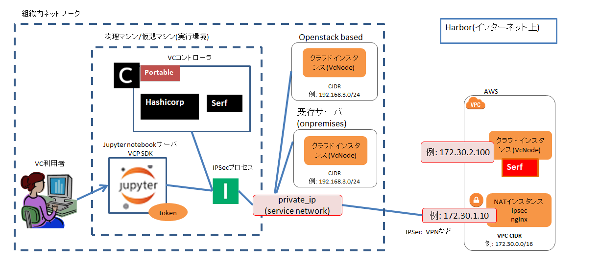

# ポータブル VC コントローラ手順書

## 1. 概要

利用者はポータブルVCコントローラを使用することにより、利用者が準備した実行環境にVCコントローラを配備し、
VCPの機能を用いてクラウド環境のリソースを利用することができる。
実行環境の例として、VirtualBox などの Linux VM 環境、クラウド上のインスタンス、利用者や利用組織が所有する
物理マシンが挙げられる。



## 2. 対応クラウドプロバイダと動作環境
### 2.1. サポートするクラウドプロバイダ
* AWS
* AWS (EC2 Spot Instance)
* Oracle Cloud Infrastructure
* Microsoft Azure
* さくらのクラウド
* 既存サーバ
  - Dockerインストール済みの sshログイン可能なLinuxマシンを「既存サーバ」として使用する
  - VCPでは既存サーバを onpremises というクラウドプロバイダとみなす
* OpenStack
  - OpenStackをベースとするオンプレミスクラウド環境での動作実績はあるが、個別のOpenStack環境に合わせて
    VCPプラグイン実装をカスタマイズする必要がある。

### 2.2. 動作確認済みの OS, Distribution 環境
* Ubuntu Server 20.04 LTS
* Debian 10 (buster)

### 2.3. 必須ソフトウェア
VCコントローラの実行環境に以下のソフトウェアがインストールされていることを前提とする。

* Docker (since version 20.10)
* Docker Compose (since version 1.29)

### 2.4. ディスク容量要件
10 Gbyte 以上を推奨する。

* ポータブルVCコントローラ Docker コンテナイメージ: 約 3 Gbyte
* VCP SDK および JupyterNotebook Docker コンテナイメージ: 約 5 Gbyte

### 2.5. ネットワーク要件

対象とするクラウドの仮想ネットワーク環境とポータブルVCコントローラ間を VPN 接続することにより、
クラウドインスタンスに対してプライベートIPアドレスによるアクセスが可能であること。

本ドキュメントでは、クラウドサービス(e.g. AWS) が提供する IPsec 接続を利用する方法を例として説明する。


```
ポータブルVCコントローラ
  [プライベートアドレス] -+- vcpsdk (Jupyter Notebook)
                        |
                        +--(組織内のネットワーク)-+--既存サーバ(onpremises)
                        |                     +-OpenStack
                        +--(ipsec/bgpなど) -- AWS
```

### 2.6. ディレクトリ構成

```
README.md          ... 本ドキュメント
docker-compse.yml  ... 起動設定ファイル
.env               ... 環境変数設定ファイル
cert/              ... SSL証明書
dummy_cert/        ... localhostからのアクセスのみで使用可能な評価目的のSSL証明書
config/            ... VCコントローラ設定ファイル
  vpn_catalog.yml  ... クラウド仮想ネットワーク環境定義ファイル
  (sakura_config.yml) ... さくらのクラウドのネットワーク設定ファイル(使用する場合)
volume/            ... VCコントローラで保存するデータ

aws/               ... AWS IPsec 接続環境構築スクリプト
```

## 3. 準備
### 3.1. 環境変数の設定
VCコントローラ起動時の環境変数設定として、 `.env` ファイルに以下の項目を設定する。

項目名|意味|デフォルト値
-------|------------------|---------------------------
VCP_VCC_PRIVATE_IPMASK | クラウドインスタンスと接続可能なVCコントローラ プライベートIPアドレス (例: `10.0.2.15/24`) | 無し
VCP_OFFICIAL_REGISTRY_ADDRESS | OfficialコンテナレジストリFQDN | `harbor.vcloud.nii.ac.jp`

### 3.2. SSL証明書

ポータブルVCコントローラの評価用として dummy_cert ディレクトリにある証明書ファイルを利用可能である。
この証明書はVCコントローラ、Jupyter Notebookサーバを同一の環境で起動することを想定している。

- SSLサーバ証明書
  * Subject Alternative Name:  `localhost`, `127.0.0.1` を設定
  * ファイル: occtr_cert.pem, occtr_key.pem
- 上記SSLサーバ証明書を発行したCA認証局の自己署名証明書
  * ファイル: ca.pem

これらを cert ディレクトリにコピーすることで評価目的での利用が可能である。

```
cp dummy_cert/* cert/
```

### 3.3. クラウド仮想ネットワーク定義ファイル
利用するクラウドのリージョンや仮想プライベートネットワークに関する情報を
VC コントローラに登録、参照するための機能がある。これを「クラウドVPNカタログ」と呼ぶ。

クラウドVPNカタログでは、クラウドプロバイダ毎に複数の仮想プライベートネットワークを定義することができ、
ポータブルVCコントローラでは YAML 形式で記述されたファイルを `config/vpn_catalog.yml` に配置する。

クラウドVPNカタログの例を以下に示す。

`config/vpn_catalog.yml`

```
cci_version: '1.0'

aws:
  default:
    aws_region: ap-northeast-1
    aws_vpc_subnet_id: subnet-fffffffffffffffff
    aws_vpc_security_group_id: sg-fffffffffffffffff
    aws_availability_zone: ap-northeast-1a
    private_network_ipmask: 172.30.2.0/24

  tokyo_subnet1:
    aws_region: ap-northeast-1
    aws_vpc_subnet_id: subnet-fffffffffffffffff
    aws_vpc_security_group_id: sg-fffffffffffffffff
    aws_availability_zone: ap-northeast-1c
    private_network_ipmask: 172.30.3.0/24

  us_west_subnet:
    aws_region: us-west-2
    aws_vpc_subnet_id: subnet-fffffffffffffffff
    aws_vpc_security_group_id: sg-fffffffffffffffff
    aws_availability_zone: us-west-2a
    private_network_ipmask: 172.30.5.0/24

sakura:
  default:
    sakura_local_switch_id: ******
    sakura_private_subnet_gateway_ip: 172.23.1.1
    sakura_zone: tk1a
    private_network_ipmask: 172.23.1.0/24

# 以下は OpenStack ベースのクラウドに対応した設定の例。設定項目は環境により異なる。
own-openstack:
  default:
    network_uuid: ffffffff
    tenant_name: mytenant
    region: RegionOne
    private_network_ipmask: 10.0.1.0/24
```

サポートするクラウドプロバイダの VPN カタログ設定項目は以下のとおりである。  
項目名は [Terraform Provider](https://registry.terraform.io/browse/providers) におけるリソース定義名を踏襲している。

#### AWS (aws)

| 項目名          | 意味            |
|----------------|----------------|
|aws_vcp_subnet_id|VPCのサブネットID|
|aws_vcp_security_group_id|VPCのセキュリティグループID|
|aws_region|リージョン (例: ap-northeast-1)|
|aws_availability_zone|サブネットのAvailabilityゾーン名 (例: ap-northeast-1a)|

#### Microsoft Azure (azure)

| 項目名          | 意味            |
|----------------|----------------|
|azure_resource_group_name|リソースグループ名|
|azure_vnet_name|仮想ネットワーク名|
|azure_subnet_name|サブネット名|
|azure_security_group_name|セキュリティグループ名|
|azure_location|データセンターのリージョン (例: japaneast, japanwest, eastus)|

#### Oracle Cloud Infrastracture (oracle)

項目名|意味|Webコンソールでの確認先
----------|-------------------------------|----
oracle_tenancy_ocid|テナンシID|管理 >> テナンシ情報
oracle_compartment_id|コンパートメントID|アイデンティティ >> コンパートメント >> コンパートメント情報
oracle_subnet_id|サブネットID|ネットワーキング >> 仮想クラウド・ネットワーク >> VCN名 >> サブネット情報
oracle_region|リージョン|管理 >> 地域管理 >> リージョン識別子（または最上部のリージョン名 >> リージョン管理）
oracle_availability_domain|可用性ドメイン|コンピュート >> インスタンス >> インスタンス情報 (注)

* (注) 可用性ドメインは Oracle Cloud のテナンシごとに異なり、Web UI からインスタンス作成を実行することで値を確認することができる。

#### さくらのクラウド (sakura)

項目名|意味
-----|-------------------------------
sakura_local_switch_id|プライベートネットワークに接続するローカルスイッチのID
sakura_private_subnet_gateway_ip|プライベートサブネットのデフォルトゲートウェイ IP アドレス
sakura_zone|ゾーンの名前 (例: tk1a, is1a)

* (注) さくらのクラウドの [リージョン・ゾーン](https://manual.sakura.ad.jp/cloud/support/region-zone.html)

### 3.4. さくらのクラウド向けのネットワーク初期化設定

さくらのクラウドで使用するプライベートIPアドレスを予め登録しておく必要がある。
`config/sakura_config.yml` を編集して
クラウド仮想ネットワーク定義ファイル `config/vpn_config.yml` でsakuraに対し定義したネットワークに対して、
yaml形式で記述する。

```
default: # クラウド仮想ネットワーク定義ファイル上のネットワーク名
  prefix_len: 24
  ip_addresses:
    - 172.23.1.2
    - 172.23.1.3
    - 172.23.1.4
    - 172.23.1.5
    - 172.23.1.6
```

各項目の意味は以下のとおりである。

項目|意味
----|------
prefix_len|IPv4サブネットのprefix length
ip_addresses|クラウドインスタンスに割り当てるするIPアドレスのリスト

### 3.5. IPsec 接続 (AWS)
クラウド仮想ネットワークとVCコントローラ間をVPN接続するために IPsec 接続環境を準備する。

#### クラウド環境の IPsec 設定
AWS サイト間 VPN (Site-to-Site VPN) 接続の機能を利用した IPsec 接続環境の構築手順を説明する。

1. Terraform スクリプト `aws/aws_vpn.tf` を実行する

```
# Docker による実行例
docker run -ti -v "$(pwd):/app" -w /app hashicorp/terraform init
docker run -ti -v "$(pwd):/app" -w /app \
  -e AWS_ACCESS_KEY_ID="anaccesskey" \
  -e AWS_SECRET_ACCESS_KEY="asecretkey" \
  -e AWS_DEFAULT_REGION="ap-northeast-1" \
  hashicorp/terraform apply

var.local_subnet
  Enter a value:   (VCコントローラ環境のサブネットを入力 例: 10.0.2.0/24)
var.my_public_ip
  Enter a value:   (VCコントローラ環境のOutbound Public IPアドレスを入力)
```

2. スクリプト実行結果として、AWS VPC に作成されたリソース情報を確認する。
    - この内容を前述の「クラウド仮想ネットワーク定義ファイル」`config/vpn_catalog.yml` に記述する。

```
Outputs:

aws_availability_zone = ap-northeast-1a
aws_vpc_security_group_id = sg-0387934d3cd06946f
aws_vpc_subnet_id = subnet-0862300dba34162ed
private_network_ipmask = 172.30.2.0/24
```

3. AWS VPC Dashboard の Site-to-Site VPN Connections から、IPsec 設定ファイルを取得する。
    - AWS VPC Dashboard > Site-to-Site VPN Connections > Download Configuration
    - Vendor: Openswan を選択し、設定ファイルをダウンロードする

#### ポータブル VC コントローラ設置環境の IPsec 設定
VCコントローラ側の IPsec 接続環境の例として、ここでは VirtualBox 上の VM (Debian 10) に
Libreswan をインストールして設定する手順について説明する。

1. Libreswan パッケージをインストールする

```
# apt-get install libreswan
```

2. Libreswan を初期化する

```
# ipsec initnss
# certutil -N --empty-password -d sql:/etc/ipsec.d
# modprobe af_key
```

3. `ipsec.conf` ファイルを作成する
    - AWS VPC Dashboard の Site-to-Site VPN Connections から取得した設定ファイルの内容を編集して利用することが可能
      * (注) `auth=esp` 指定は削除すること

`/etc/ipsec.conf`

```
conn tunnel1
     authby=secret
     auto=start

     left=%defaultroute
     leftid=@tunnel1
     leftsubnets=10.0.2.0/24 # ポータブル VC コントローラ設置環境の Private Subnet
     leftsourceip=10.0.2.15 # ポータブル VC コントローラ設置環境の Private IP

     right=203.0.113.1 # クラウド側 IPsec インスタンスの Public IP
     rightsubnet=172.30.0.0/16 # クラウドインスタンスの VPC Subnet

     type=tunnel
     ikelifetime=8h
     keylife=1h
     phase2alg=aes128-sha1;modp1024
     ike=aes128-sha1;modp1024
     keyingtries=%forever
     keyexchange=ike
     dpddelay=10
     dpdtimeout=30
     dpdaction=restart_by_peer
```

4. `ipsec.secrets` ファイルを作成する
    - AWS VPC Dashboard の Site-to-Site VPN Connections から取得した設定ファイルに記載された内容をコピーして利用可能

`/etc/ipsec.d/tunnel1.secrets`

```
# VCコントローラ環境の Outbound Public IP, クラウド側 IPsec の IP, 事前共有鍵を書く
x.x.x.x 203.0.113.1: PSK "XXXXXX"
```

5. IPsec を起動する

```
# ipsec pluto --logfile /var/log/ipsec.log --use-netkey --uniqueids
```

6. IPsec の接続確立を確認する
    - `ipsec status` コマンドを実行し、以下の出力があること
       >  `Total IPsec connections: loaded 1, active 1`
       >  `IPsec SA established`
    - AWS VPC Dashboard > Site-to-Site VPN Connections > Tunnel Details
      Tunnel 1 の Status が **UP** であること

## 4. 起動手順
### 4.1. VCコントローラの起動

1. 準備  
  以下の各設定等が完了していること。
    * 環境変数設定 (`.env`)
    * クラウド仮想ネットワーク定義ファイル (`config/vpn_catalog.yml`)
    * X509 形式 SSL 証明書 (`cert/*.pem`)
      * `ca.pem` (Private CA 利用時), `occtr_cert.pem`, `occtr_key.pem`
    * クラウド仮想ネットワークとの VPN (IPsec) 接続

2. 起動  
   docker-compose コマンドにより、VC コントローラのコンテナを起動する。

```
# docker-compose up -d
```

3. VCコントローラ初期化  
   以下のコマンドを実行してVCコントローラを起動する。

```
# docker-compose exec occtr ./init.sh
```

### 4.2. VCP SDK実行環境の構築

VCP SDKの実行方法は以下の2通りの方法がある。

1. Jupyter Notebookを使用する。
2. VCP SDKをpythonプログラムから使用する。

#### 方法1: Jupyter Notebook を使用する

1. 以下のコマンドを実行して、Jupyter Notebookのコンテナを起動する。  
  `cloudop-notebook-20.04.0-jupyter` という名前でコンテナが実行される。

```
# bash vcp-jupyter-20.04.0.sh {{Notebookサーバに設定するパスワード}}
```

2. `./cert/ca.pem` をNotebookコンテナにインストールする。

```
# docker cp cert/ca.pem cloudop-notebook-20.04.0-jupyter:/usr/local/share/ca-certificates/vcp_ca.crt
# docker exec cloudop-notebook-20.04.0-jupyter update-ca-certificates
```

コンテナ内に証明書が入るので、コンテナを再起動すると消える。コンテナ再起動後に実行する必要が有る。

#### 方法2: pythonプログラムからVCP SDKを使用する

VCP SDKの unit_test/cli_test/README.md の手順に従って環境を構築すること。

#### VCP SDK 設定

1. `vcpsdk/config/vcp_config.yml` ファイルを作成する。

項目名|意味
-----------|----------------------------------
vcc > host|VCコントローラのプライベートIPアドレス (例: `10.0.2.15`) <br> (VCコントローラ起動時の環境変数 `VCP_VCC_PRIVATE_IPMASK` からマスク指定を除いた部分)
vcc > name|VCコントローラ名 (任意でつけてよい)

2. 使用するクラウド環境のクレデンシャル情報を Vault に書き込む。

    - 詳細な手順は、VCP SDKの `vault/_write_credential_to_vault.ipynb.template` を参照すること。

## 5. VCコントローラ 停止・再起動手順

`docker-compose stop` または `docker-compose down` コマンドによりVCコントローラを停止することができる。

再開するには `docker-compose start` または `docker-compose up -d` コマンドを実行後、以下の初期化スクリプトを実行する。

```
# docker-compose exec occtr ./init.sh
```

## 6. VCコントローラの破棄
不要になった VC コントローラを破棄する際には、以下の手順を踏む。

1. VCコントローラで作成したVCノード(クラウドインスタンス)が削除済みであることを確認する。
2. VCコントローラを停止する。
3. `volume` ディレクトリを削除する。

## 7. 管理機能
ポータブルVCコントローラの管理者向けの機能について説明する。

### 7.1. VCコントローラのユーザの管理
* 登録されているユーザのリスト

```
# docker-compose exec occtr ./bin/vcc_user_cli.py list
```

* ユーザの登録
  * ROLE は `super` または `regular` のいずれかを指定する

```
# docker-compose exec occtr ./bin/vcc_user_cli.py add USER_NAME ROLE
```

* ユーザのロールの変更
  * ROLE は `super` または `regular` のいずれかを指定する

```
# docker-compose exec occtr ./bin/vcc_user_cli.py modify USER_NAME ROLE
```

### 7.2. VCP REST APIアクセストークンの発行

VCP REST APIアクセストークンの発行はVCP SDKでの操作や、Vaultに対する秘密情報の読み書きに使用するためのアクセストークンを
VC利用者に対して発行することができる。

以下のコマンドを実行して出力される文字列が `fullaccess` 権限を持つVCP REST API
アクセストークンである。引数にユーザ名を指定する。指定しない場合は `nobody` という `regular` ロールのユーザを割り当てる。

```
# docker-compose exec occtr ./create_token.sh [USER_NAME]
```

以下のような文字列が表示される。この文字列をVCP利用者に配布し、VCC REST APIアクセストークンとして設定して使用する。

```
xxxxxxxx-69a9-ed97-1405-9e685a965b01
```

### 7.3. VPNカタログの更新

`config/vpn_catalog.yml` ファイルにVPNカタログの内容を記述し、初期化スクリプトを実行することで設定を反映させる。

```
# docker-compose exec occtr ./init.sh
```

### 7.4. ログの確認

ポータブルVCコントローラコンテナの起動ログは以下のコマンドで参照する。

```
# docker-compose logs
```

ポータブルVCコントローラコンテナ内の `/opt/occ/var/logs` 配下と`/tmp` ディレクトリ
にログを出力する。
ポータブルVCコントローラコンテナ内の `/tmp` ディレクトリにログを出力する

### 7.5. プロセスの正常性確認

VCコントローラ内のプロセスの正常性を確認するには、以下のコマンドを実行し、2列目がすべて `RUNNING`
であることを確認する。

```
# docker-compose exec occtr supervisorctl status
```

実行例

```
# docker-compose exec occtr supervisorctl status
cron                             RUNNING   pid 132, uptime 1 day, 7:38:33
grafana                          RUNNING   pid 95, uptime 1 day, 7:38:35
occtr                            RUNNING   pid 107, uptime 1 day, 7:38:34
occtr_consul                     RUNNING   pid 30, uptime 1 day, 7:38:45
prometheus                       RUNNING   pid 85, uptime 1 day, 7:38:37
redis                            RUNNING   pid 42, uptime 1 day, 7:38:44
rqworkers:rqworker_default0      RUNNING   pid 47, uptime 1 day, 7:38:43
rqworkers:rqworker_default1      RUNNING   pid 52, uptime 1 day, 7:38:42
rqworkers:rqworker_update        RUNNING   pid 46, uptime 1 day, 7:38:43
rsyslogd                         RUNNING   pid 25, uptime 1 day, 7:38:46
serf                             RUNNING   pid 56, uptime 1 day, 7:38:39
vault                            RUNNING   pid 70, uptime 1 day, 7:38:38
```

## 8. 利用者向け機能
### 8.1. Grafana

VC利用者は、 `http://{VCコントローラのアドレス}:8000/grafana/` をWebブラウザで開くと
Grafanaのダッシュボードを利用できる。

デフォルトで設定されているアカウントは以下のとおり。

- ユーザ: `admin`
- パスワード: `admin`

## 9. 付録A: ネットワークに関する情報

使用するポート番号は以下のとおりである。

### 9.1. VCコントローラ

サービス|ポート番号
------------|----
VCP REST API|443
Hashicorp Vault|8443
serf|7373,7943
Grafana|(3000) 8080

Grafanaはポート8080で起動しているnginxを通してアクセスする。 `/grafana` というサブディレクトリで
GrafanaのWeb UIを閲覧できるようにするために起動している。

### 9.2. Juypter Notebook

サービス|ポート番号
------------|----
Jupyter Notebook|8888

### 9.3. VCノード (クラウドインスタンス)

サービス|ポート番号
------------|----
dockerのリモート実行|2375
sshd(利用者用ベースコンテナ)|22
sshd(管理者用)|20022

### 9.4. Official コンテナレジストリ

VCコントローラで起動したVCノードではBaseコンテナというDockerコンテナが実行される。
実行するDockerコンテナイメージは harbor.vcloud.nii.ac.jp により管理されている。

VCコントローラから `harbor.vcloud.nii.ac.jp` (TCPポート 443) に対する Outbound 通信を許可するように、VCコントローラを起動する環境のネットワーク設定を行う必要がある。

## 10. 付録B: 本運用のためのSSL証明書の作成

VCコントローラのREST APIとVaultのアクセスにSSLでアクセスするために、SSLの証明書が必要である。

```
CA証明書(ca.pem) 
   ↓ 信頼
VCコントローラのサーバ証明書(occtr_cert.pem, occtr_key.pem)
```

### 10.1. CA認証局の証明書(ca.pem)

使用するネットワークを管理する組織のポリシーに従って作成する。

### 10.2. ポータブルVCコントローラのSSL証明書、サーバ鍵

`dummy_cert/` にあるSSL証明書 `ca.pem`, `occtr_cert.pem` およびサーバ鍵ファイル `occtr_key.pem`
は評価用のサンプルであり、本運用を想定していない。

サーバ証明書で必要な設定: Subject Alternative Name (SAN) に以下を設定する。
IP.1, DNS.2はVCP SDK使用環境(例: Jupyter Notebookサーバ)から見た
VCコントローラのIPアドレス、DNS名(使用する場合)である。

OpenSSL の `openssl.cnf` での設定例(抜粋) は以下の通りである。

```
[ v3_req ]

[alt_names]

IP.1 = 127.0.0.1
IP.1 = {{プライベートネットワーク上でのIPアドレス}}
DNS.1 = localhost
DNS.2 = {{DNS名(使用する場合)}}
```

`cert/ca.pem` にCA証明書を入れると、VCコントローラの初期化コマンド (init.sh)実行時に
VCコントローラとvaultは信頼する証明書として読み込む。

