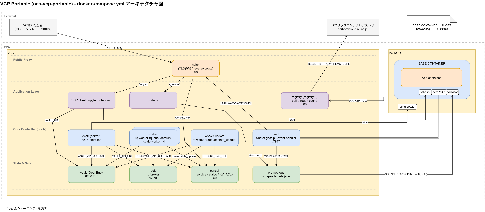
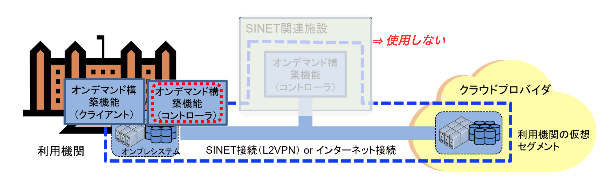
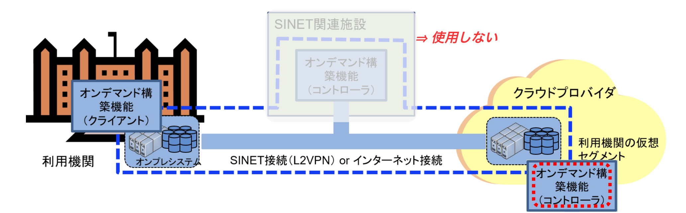
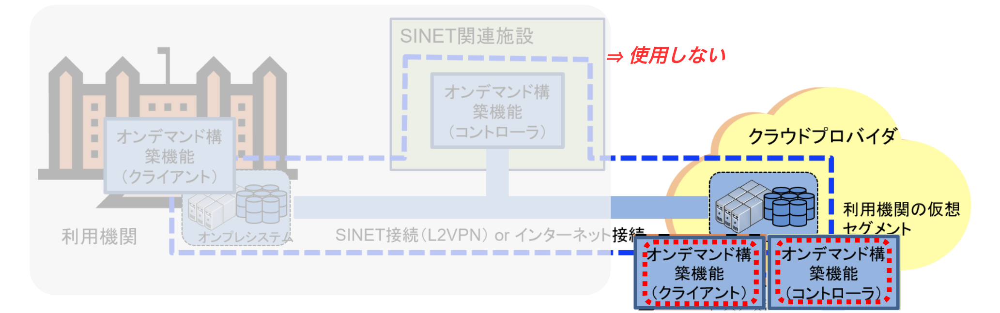

# VCP ポータブル版 について

「VCP ポータブル版」は、VC コントローラをインターネット接続可能な任意の場所に設置することができ、
インストール、管理、運用も利用機関側で単独で行っていただくことが可能です。

学認クラウドオンデマンド構築サービス (OCS) の概要および仕様については [学認クラウドの公式 Web サイト](https://cloud.gakunin.jp/ocs/) をご覧ください。

## VCP ポータブル版の利用

VCP ポータブル版のご利用にあたり、ユーザ登録をお願いしております。
ユーザ用メーリングリストからOCSに関するリリース、バグフィックス情報、 FAQのご紹介等の情報提供をさせていただきます。
下記よりご登録お願いいたします。

- [ユーザ登録フォーム](https://reg.nii.ac.jp/m/ocs_user_registration)

## 構成



## クイックスタート

> [!NOTE]
> Ubuntu環境が前提となっている。
> 動作確認済みバージョン: Ubuntu 22.04 LTS, Ubuntu 24.04 LTS

- 設定ファイル等セットアップ  

    - 証明書、環境変数等  

        内部で使用する証明書等の作成や環境変数の設定を行います。  

        ```
        sudo bash init.sh
        ```

        作成された `.env` の内容が正しいことを確認してください。  
        `NGINX_PROXY_HOST`は手動での設定が必須です。外部公開用ホスト名を設定してください。  
        デフォルトの設定では、このNginxでTLS終端を行う設定となっているため、`localhost`等で検証を行う場合は、`./nginx/nginx.conf.template` の内容を変更してください。  

        ex. localhostでの検証向け設定例

        ```
        - listen 8080 ssl;
        + listen 8080;
        server_name ${NGINX_PROXY_HOST};
        - ssl_certificate      /etc/nginx/certs/fullchain.pem;
        - ssl_certificate_key  /etc/nginx/certs/privkey.pem;
        ```

        (項目一覧: occtrのドキュメント参照)  

    - VPNカタログ(`config/vpn_catalog.yml`)  

        利用するクラウドプロバイダごとのネットワーク設定（Region, subnet等）を記載します。  
        記載する項目: [リファレンス-VPNカタログ](./docs/references/vpncatalog.md)  

- コンテナ起動  

    コンテナ一式を起動します。`worker`（VCコントローラ用ジョブキュー）の数は環境に合わせて設定してください。  

    ```
    docker compose up -d --scale worker=3
    ```

- コンテナ数確認  

    ```
    $ docker compose ps | wc -l
    15
    ``` 

- VCコントローラ用アクセストークン発行  

    VCコントローラ(occtrコンテナ)が稼働するマシン上で以下を実行し、VCコントローラ用アクセストークンを発行します。  

    ```
    docker compose exec occtr vcc token create
    ```

- Jupyterアクセス（ブラウザ）  

    Jupyter Notebookサーバのログイン用初期トークンを確認します。

    ```
    docker compose logs jupyter | grep token
    ```

    `https://<host>:8080/jupyter` にアクセスし、確認した初期トークンでログインしてください。  
    `~/work/setup/credential_setup.ipynb` を開き、VCコントローラ用アクセストークンの入力とvcpsdkクライアントの初期化を行い、VCコントローラが利用できることを確認してください。  

## リセット

構築済み環境を削除するには、コンテナの停止・Docker volumeの削除と、ホスト側にマウントされたファイルの削除を行います。

コンテナ・Docker volumeの削除  

```
docker compose down -v
```
　
マウントされたファイルの削除  

```
sudo rm -rf volume vault/data cert
```


## VCコントローライメージ変更

```
docker compose down -v occtr worker worker-update
```
```
docker compose up -d --scale worker=<ワーカー数>
```

## VCコントローラ配置例

### 1. VCP ポータブル版 / 利用機関側にコントローラを配置

- SINET関連施設にあるコントローラを使用せず、利用機関側にポータブル版のコントローラを配置します。
- 利用機関・クラウドプロバイダ間の接続に SINET関連施設は介入しません。
- ポータブル版のコントローラは、利用機関におけるネットワークの運用ポリシーへの影響を極力小さくしたい場合の選択肢となります。



### 2. VCP ポータブル版 / クラウドにコントローラを配置

- SINET関連施設にあるコントローラを使用せず、クラウドの仮想セグメントにポータブル版のコントローラを配置します。
- 利用機関・クラウドプロバイダ間の接続に SINET関連施設は介入しません。
- 利用機関・クラウドプロバイダ間の接続方式として VPN を使わない構成も可能となります。



### 3. VCP ポータブル版 / すべてクラウド側に配置

- ポータブル版のコントローラ、クライアントの両方をクラウドの仮想セグメントにポータブル版のコントローラを配置します。
- アプリケーション環境をクラウドの仮想セグメントに閉じた構成で構築することができます。



> [!NOTE]
> 「ポータブル版」（セルフホスト型）に対して、サービス版（提供版）VCコントローラは2026年に廃止。
