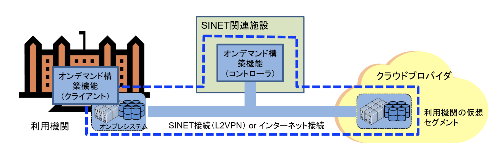

# ポータブル版 VCP について

「ポータブル版 VCP」は、VC コントローラをインターネット接続可能な任意の場所に設置することができ、
インストール、管理、運用も利用機関側で単独で行っていただくことが可能です。

オンデマンド構築サービスの概要および仕様については [学認クラウドの公式 Web サイト](https://cloud.gakunin.jp/ocs/) をご覧ください。

## 通常版とポータブル版 VCP の比較

### A. 通常利用ケースでの構成

- 利用機関・クラウドプロバイダ間の接続に加え、SINET関連施設に設置している本サービスのコントローラとの接続が必要です。
- SINET接続もしくはインターネット接続が利用できます。
- 本サービスのクライアントソフトウェアからSINET関連施設に設置されている本サービスのコントローラとクラウドプロバイダ上の資源やサービスを制御し、アプリケーション実行環境を構築します。

### B-1. ポータブル版 VCP / 利用機関側にコントローラを配置

- SINET関連施設にあるコントローラを使用せず、利用機関側にポータブル版のコントローラを配置します。
- 利用機関・クラウドプロバイダ間の接続に SINET関連施設は介入しません。
- ポータブル版のコントローラは、利用機関におけるネットワークの運用ポリシーへの影響を極力小さくしたい場合の選択肢となります。

### B-2. ポータブル版 VCP / クラウドにコントローラを配置

- SINET関連施設にあるコントローラを使用せず、クラウドの仮想セグメントにポータブル版のコントローラを配置します。
- 利用機関・クラウドプロバイダ間の接続に SINET関連施設は介入しません。
- 利用機関・クラウドプロバイダ間の接続方式として VPN を使わない構成も可能となります。

### B-3. ポータブル版 VCP / すべて AWS に配置

- ポータブル版のコントローラ、クライアントの両方をクラウドの仮想セグメントにポータブル版のコントローラを配置します。
- アプリケーション環境をクラウドの仮想セグメントに閉じた構成で構築することができます。
- 今回のハンズオンでは、この構成で AWS を利用します。

