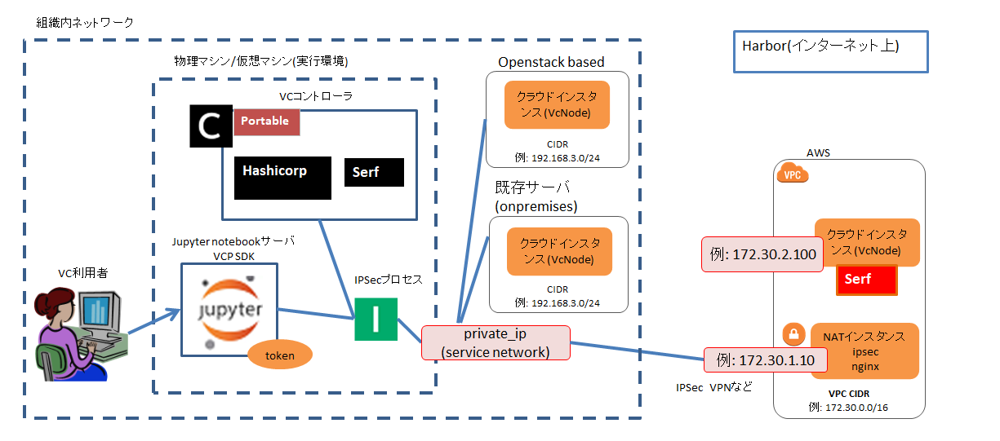

# 概要

利用者はポータブルVCコントローラを使用することにより、利用者が準備した実行環境にVCコントローラを配備し、
VCPの機能を用いてクラウド環境のリソースを利用することができる。
実行環境の例として、VirtualBox などの Linux VM 環境、クラウド上のインスタンス、利用者や利用組織が所有する
物理マシンが挙げられる。

## 対応クラウドプロバイダと動作環境

* AWS
* AWS (EC2 Spot Instance)
* Oracle Cloud Infrastructure
* Microsoft Azure
* Google Cloud Platform
* さくらのクラウド
* OpenStack
    - OpenStackをベースとするオンプレミスクラウド環境での動作実績はあるが、個別のOpenStack環境に合わせてVCPプラグイン実装をカスタマイズする必要がある。
* MDX2
* Proxmox VE
* 既存サーバ
    - Dockerインストール済みの sshログイン可能なLinuxマシンを「既存サーバ」として使用する
    - VCPでは既存サーバを onpremises というクラウドプロバイダとみなす
    - VCPで非サポートのクラウドプロバイダを使用する場合に、予め用意した仮想マシンを「既存サーバ」として使用することができる