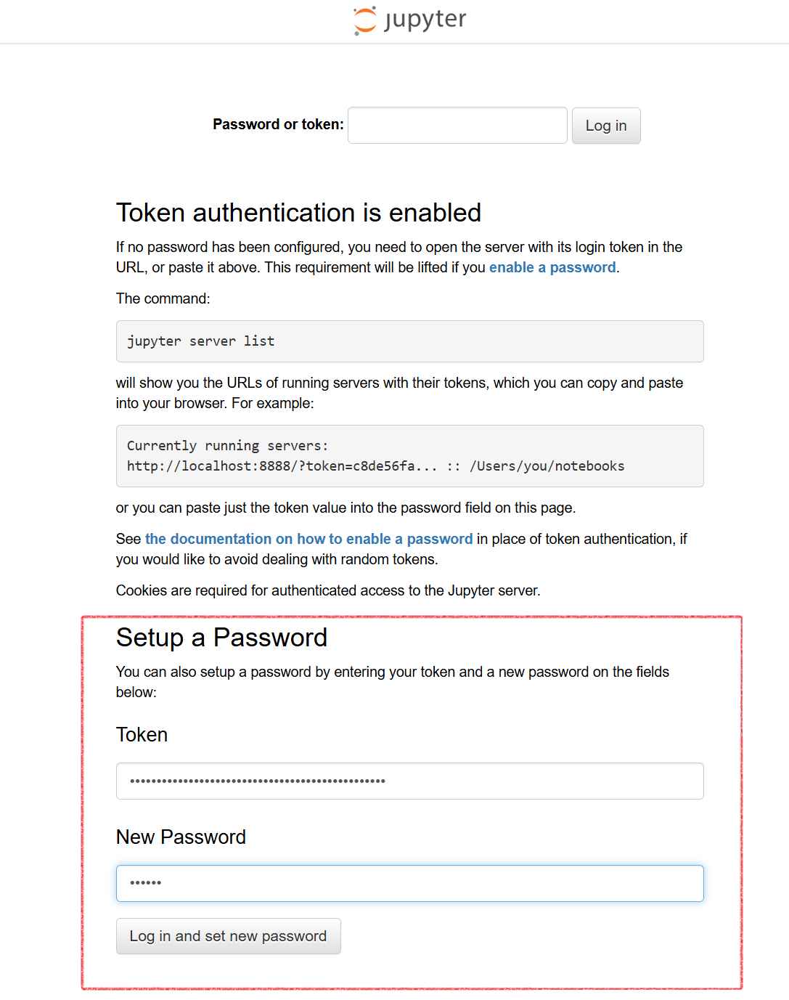

# インストール

Docker Compose を用いたマルチコンテナ構成により、VCP関連サービス群を起動します。

## 目次

- [要件](#要件)
    - [動作確認済みの OS, Distribution 環境](#動作確認済みの-os-distribution-環境)
    - [ディスク容量要件](#ディスク容量要件)
    - [ネットワーク要件](#ネットワーク要件)
- [構成の確認](#構成の確認)
    - [サービス一覧](#サービス一覧)
- [準備](#準備)
    - [リポジトリのダウンロード](#リポジトリのダウンロード)
    - [初期セットアップ](#初期セットアップ)
- [起動](#起動)
    - [VCコントローラの起動](#vcコントローラの起動)
    - [VCコントローラ利用準備](#vcコントローラ利用準備)
    - [Jupyter Notebookサーバ ログイン](#jupyter-notebookサーバ-ログイン)
- [クラウドプロバイダ利用設定](#クラウドプロバイダ利用設定)
    - [クラウド仮想ネットワーク定義ファイル（クラウドVPNカタログ）](#クラウド仮想ネットワーク定義ファイルクラウドvpnカタログ)
    - [VCコントローラとクラウド仮想ネットワーク間の通信設定](#vcコントローラとクラウド仮想ネットワーク間の通信設定)
- [補足](#補足)
    - [TLS設定](#tls設定)
    - [Web UI](#web-ui)
        - [Grafana](#grafana)
        - [Jupyter](#jupyter)
        - [Consul](#consul)
    - [VCコントローラの管理操作](#vcコントローラの管理操作)
    - [環境変数一覧](#環境変数一覧)

## 要件

### 動作確認済みの OS, Distribution 環境

* Ubuntu Server 22.04 LTS
* Ubuntu Server 24.04 LTS

### ディスク容量要件

10 Gbyte 以上を推奨する。

* Docker コンテナイメージ: 約 6GB
    * ポータブルVCコントローラ/worker/worker-update: 約 2GB
    * JupyterNotebook: 約 2GB
    * 他: 計約 2GB
* Docker コンテナボリューム等(最低): 約 1GB

### ネットワーク要件

対象とするクラウドの仮想ネットワーク環境上に起動するクラウドインスタンスに対して、ポータブルVCコントローラがプライベートIPアドレスでアクセスできること。

- 例
    1. VCコントローラとクラウド仮想ネットワーク環境をVPN接続する
    1. VCコントローラとクラウド仮想ネットワーク環境を同一ネットワーク上に配置する

> [!NOTE]
> 事前準備用の参考資料が用意されているものは、事前に確認しておくこと
> - [ポータブル版VCPのセットアップ手順 (for proxmox)](./references/providers/proxmox.md)
> - [ポータブル版VCPのセットアップ手順 (for mdx1)](./references/providers/mdx1.md)

## 構成の確認

ここでは、VCコントローラ関連サービス群を１つのマシン上にセットアップする標準的な構成を想定している。  


### サービス一覧  

以下の各サービスが、Dockerコンテナとして起動する。

|コンテナ|サービス|公開ポート番号|用途|
|-------|--------|-------------|----|
|occtr|VCP REST API||VCコントローラのREST API|
|vault|OpenBao||クラウドプロバイダの認証情報等を管理|
|serf|serf|7947(TCP/UDP)|各VCノードの死活監視のため、VCPネットワーク内で利用|
|grafana|Grafana||GrafanaのWeb UI|
|nginx|Nginx|8080(TCP)|ユーザアクセスの入口|
|consul|consul||KVSストアの提供。Unitgroup等の情報を管理|
|jupyter|jupyter||VCP SDKを利用可能なJupyterLab環境の提供|
|redis|redis||workerのジョブキュー(rq)用ミドルウェア|
|prometheus|prometheus||メトリクス収集。Grafanaのデータソースとして利用|
|registry|registry|5000(TCP)|各VCノードから利用することを想定、VCPネットワーク内で利用|
|worker|worker||VCPの非同期タスク処理(rq worker、defaultキュー)|
|worker-update|worker-update||VCノードの状態更新処理(rq worker、state_updateキュー)|

> [!NOTE]
> Grafana, jupyter は 初期設定ではnginxを通してアクセスするよう設定されている（`/grafana`, `/jupyter` でアクセス）。

## 準備

### リポジトリのダウンロード

VCコントローラをインストールするマシン上に、本リポジトリをダウンロードしておく。  
githubからzipでダウンロードして展開する、もしくは `git clone` 等、任意の方法で配置しておく。  

**例: `git clone` コマンドを用いたダウンロード**

```
# git clone https://github.com/nii-gakunin-cloud/ocs-vcp-portable.git
```

### 初期セットアップ

以下のコマンドを実行し、必要なディレクトリの作成等を行う。  

```
# sudo bash init.sh
```

以下の設定がなされる。  

- Docker (composeプラグイン含) のインストール（未インストールの場合のみ実行）
- 環境変数設定(`.env`)  
    ファイルが存在しない場合のみ生成される。以下の値は実行時に自動設定される（他の項目は[環境変数一覧](#環境変数一覧)のデフォルト値が使用される）。
    - `GF_SECURITY_ADMIN_PASSWORD`: ランダムなパスワードを生成
    - `CONSUL_INITIAL_TOKEN`: UUIDを生成
    - `VCP_VCC_PRIVATE_IPMASK`, `SERF_ADVERTISE`, `BC_REGISTRY_HOST`: 実行マシンのプライベートIPアドレスから自動設定
- サービス間通信用SSL証明書作成  (`certs/`)  
    jupyter環境からポータブルVCコントローラ・vaultに対してHTTPS通信を行うため、SSL証明書を準備する必要がある。証明書は、`cert/` ディレクトリに配置する（既に存在する場合は再作成しない）。
- データ用ディレクトリ (`volume/`) の作成  
    各サービスが利用するデータディレクトリを作成し、コンテナ内で利用するユーザーに合わせて所有者・権限を設定する。
    - `volume/jupyter`
    - `volume/vault/data`
    - `volume/grafana/data`
    - `volume/prometheus/data`

## 起動

### VCコントローラの起動

1. 準備  
    以下の各設定等が完了していること。  
    ※ `init.sh` の実行により、最低限動作に必要な設定は行われている。  

    * 環境変数設定 (`.env`)
    * サービス間通信用SSL証明書作成 (`certs`)

2. 起動  

    docker compose を利用し、VC コントローラのコンテナを起動する。
    VCPがリクエストを処理するワーカー数は `worker=2` の数値部分で設定を行う。

    ```
    # docker compose up -d --scale worker=2
    ```

    コンテナが起動したことを確認する。

    ```
    # docker compose ps
    CONTAINER ID   IMAGE                                                                 COMMAND                  CREATED         STATUS                  PORTS     NAMES
    1e17a50b5382   nginx:1.27.3                                                          "/docker-entrypoint.…"   1 minutes ago    Up 1 minutes                       ocs-vcp-portable-nginx-1
    da594c31e6d6   harbor.vcloud.nii.ac.jp/vcp/occtr:26.10.0                       "/usr/bin/supervisor…"   1 minutes ago      Up 1 minutes                         ocs-vcp-portable-occtr-1
    ~~~~~~~~~
    ```

### VCコントローラ利用準備

- VCコントローラ用のアクセストークン取得  

    VCコントローラを利用するための認証はトークンで行う。  

    ```
    # docker compose exec occtr vcc token create
    ```

    以下のようなトークンが出力される

    ```
    s.xxxxxxxxxxxxxxxxxxxxxxxx
    ```

- Jupyter Notebookサーバのログイン用トークンの確認  

    Jupyter Notebookサーバへのログインはトークンで行う。  
    初回ログイン時にパスワードを設定し、以降パスワードでのログインも可能。（後述する[Jupyter Notebookサーバ ログイン](#jupyter-notebookサーバ-ログイン)参照）  

    ```
    # docker compose logs jupyter | grep token
    ```

    URLのクエリパラメータ部分の `token` の値（`xxxxxxxxxx`）がJupyterNotebookサーバログイン用のトークン。  

    ```
    # docker compose logs jupyter|grep token
    jupyter-1  | [I 2026-09-17 12:35:35.324 ServerApp] http://localhost:8888/jupyter/lab?token=xxxxxxxxxx
    jupyter-1  | [I 2026-09-17 12:35:35.324 ServerApp]     http://127.0.0.1:8888/jupyter/lab?token=xxxxxxxxxx
    jupyter-1  |         http://localhost:8888/jupyter/lab?token=xxxxxxxxxx
    jupyter-1  |         http://127.0.0.1:8888/jupyter/lab?token=xxxxxxxxxx
    ```

> [!TIP]
> ここで期待した結果が得られない場合、コンテナのログを確認する。
>
> vcコントローラのログ: `docker compose logs occtr`  
> 
> Jupyterコンテナのログ: `docker compose logs jupyter`


## クラウドプロバイダ利用設定

VCコントローラから各種プロバイダ上に仮想マシンを起動するために必要な設定を行う。  

### クラウド仮想ネットワーク定義ファイル（クラウドVPNカタログ）

利用するクラウドのリージョンや仮想プライベートネットワークに関する情報をVCコントローラに登録・参照するための機能がある。これを「クラウドVPNカタログ」と呼ぶ。  
ポータブルVCコントローラでは YAML 形式で記述されたファイルを `config/vpn_catalog.yml` に配置する。ここに、VCコントローラから起動するマシンの接続先ネットワーク等を指定する。    

[管理操作-クラウド仮想ネットワーク定義ファイルの更新](./manipulation.md#クラウド仮想ネットワーク定義ファイルの更新) を参考に、設定・反映を行う。

> [!IMPORTANT]
> 利用するクラウドプロバイダごとに設定が必須である。

### VCコントローラとクラウド仮想ネットワーク間の通信設定

VCコントローラから、VCノードとして起動したインスタンスに対してプライベートIPアドレスでアクセス可能となるよう、ネットワーク設定を行う。  
例えば、クラウド仮想ネットワークとVCコントローラ間をVPN接続するために IPsec 接続環境を準備する。  

参考: [AWS サイト間 VPN (Site-to-Site VPN) 接続の機能を利用した IPsec 接続環境の構築例](examples.md#aws-サイト間-vpn-site-to-site-vpn-接続の機能を利用した-ipsec-接続環境の構築例)

> [!NOTE]
> VCコントローラから、VCノードとして起動したインスタンスに対してプライベートIPアドレスでアクセス可能とすることが目的である。
> したがって、VCコントローラとVCノードが同一ネットワーク上に配置されている場合は、IPsec 接続は不要である。


### Jupyter Notebookサーバ ログイン

- 初回ログイン  

    `http://{VCコントローラのアドレス}:8080/jupyter/` にアクセスする。  
    初回ログイン時は、先に確認したJupyter Notebookサーバのログイン用トークンを入力してログインする。  
    このとき、同時にパスワードを設定すると、以降はパスワードによるログインも可能となる。  

    

- VCコントローラの動作確認  

    Jupyter Notebookサーバ上で、VCコントローラの利用セットアップを行う。  
    `work/setup/credential_setup.ipynb` を開き、ノートブック上の説明に従って、利用するクラウドプロバイダの認証情報を登録する。  


## 補足

### TLS設定

本手順で構築した標準構成では、nginxはTLS終端を行わず、`http://localhost:8080/` もしくは、 `http://{IPアドレス}:8080/` でのHTTPアクセスとなる。  
前段に別のロードバランサやリバースプロキシを配置してそちら側でTLS終端を行う構成や、`localhost` 等でのローカル動作確認を行う場合は、デフォルト設定のままでよい。  
一方、nginx自身でTLS終端を行い、VC利用者のブラウザ等から、VCコントローラ設置マシンに付与したグローバルIPアドレスに対応するFQDNへ直接HTTPSアクセスさせたい場合は、証明書の設定を行う。  
参考: [TLS設定](examples.md#tls設定)

### Web UI

起動したコンテナ群のうち、Web UI を持つものの一覧について説明する。  

#### Grafana

VC利用者は、 `http://{VCコントローラのアドレス}:8080/grafana/` をWebブラウザで開くと
Grafanaのダッシュボードを利用できる。

デフォルトで設定されているアカウントは以下のとおり。  

- ID: `admin`
- パスワード: [ `.env` にて、`GF_SECURITY_ADMIN_PASSWORD`　に設定されているパスワード ]

#### Jupyter

VC利用者は、 `http://{VCコントローラのアドレス}:8080/jupyter/` をWebブラウザで開くと
VCP SDKが利用可能なJupyterLab環境にアクセスできる。

初回アクセス時はログイン用トークンの入力が必要になる。以下のコマンドでコンテナのログから初期トークンを確認する。

```
# docker compose logs jupyter | grep token
```

ログイン後、`work/setup/credential_setup.ipynb` を開き、VCコントローラ用アクセストークン（[VCP REST APIアクセストークンの発行](manipulation.md#vcp-rest-apiアクセストークンの発行)で発行したもの）を設定してVCP SDKクライアントを初期化することで、VCコントローラの機能が利用できる。

#### Consul

VCコントローラの管理者は、 `http://{VCコントローラのアドレス}:8080/consul/` をWebブラウザで開くと
Consulの管理画面（サービスカタログ・KVSの状態確認等）にアクセスできる。

ConsulはACLが有効化されているため、ログイン(Log in)時に「ACL Token」欄へトークンを入力する必要がある。初期状態では `.env` の `CONSUL_INITIAL_TOKEN` に設定されている値（管理者用トークン）を使用する。

> [!NOTE]
> Consul UIはVCコントローラの内部状態を確認するための管理者向け機能であり、VC利用者が通常の利用で参照する必要はない。

### VCコントローラの管理操作

VCコントローラのイメージ変更や停止・再起動等については、[VCコントローラ 各種操作手順](manipulation.md)参照。

### 環境変数一覧

|必須|項目名|意味|デフォルト値|備考|
|----|-----|----|-----------|---|
|✓|OCCTR_IMAGE|VCコントローラコンテナイメージ| - |occtr, worker, worker-update で共通|
|✓|VCP_VCC_PRIVATE_IPMASK | クラウドインスタンスと接続可能なVCコントローラ プライベートIPアドレス (例: `10.0.2.15/24`) | - ||
|✓|GF_SECURITY_ADMIN_PASSWORD | Grafanaの管理者パスワード | - ||
|✓|SERF_ADVERTISE | Serfのadvertise addr | - | 基本的に、vccが起動するマシンのIPアドレスを指定する |
|✓|CONSUL_INITIAL_TOKEN | Consulの管理者用トークン(UUID) | - ||
||CONSUL_TOKEN_FILE | VCCがconsul kvsを利用するためのトークンファイルパス | `/opc/occ/var/occtr/consul_token` | |
||CONSUL_TOKEN | VCCがconsul kvsを利用するためのトークン | | 指定した場合、`CONSUL_TOKEN_FILE` より優先される |
||CONSUL_HTTP_ADDR | Consulのアドレス | `localhost:8500` | |
||CONSUL_KVS_URL | Consul kvs のURL | `http://{CONSUL_HTTP_ADDR}/v1/kv` | |
||BC_REGISTRY_HOST | コンテナレジストリホスト | `harbor.vcloud.nii.ac.jp` | ポートは固定で`5000`を使用 |
||REQUESTS_CA_BUNDLE | SSL証明書のパス | `/etc/ssl/certs/ca-certificates.crt` | |
||VAULT_API_URL | VaultAPIアクセス用URL | `https://localhost:8200/v1` | |
||REDIS_HOST | redisアクセス用ホスト指定 | `localhost` | |
||REDIS_PORT | redisアクセス用ポート指定 | `6379` | |
||REDIS_PASSWORD | redisアクセス用パスワード指定 | | |  