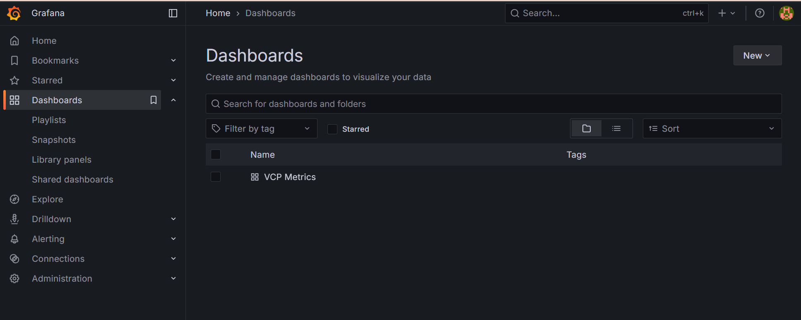
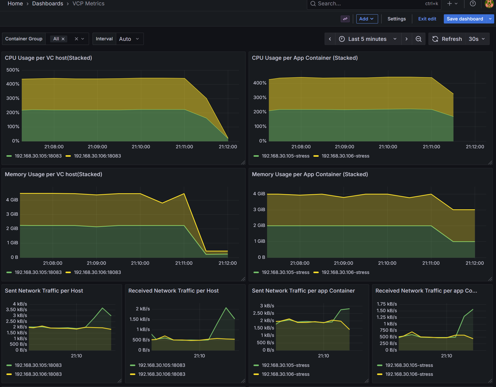

# Grafana

## 概要

Grafana は、VCPで起動したVCノード（仮想マシン）およびVCP関連コンテナのリソース使用状況を可視化するためのダッシュボードツールである。  
表示するメトリクスは `prometheus` が収集したものをデータソース（`DS_VCP`、`http://prometheus:9090`）として参照する。

### メトリクス収集の仕組み

- VCノードは、起動時にVCコントローラの `serf` クラスタへ参加する。ノードが参加(`member-join`)すると、`serf` のイベントハンドラがそのノードのメトリクスエンドポイント（`{ノードのIPアドレス}:18083`）を Prometheus のターゲット定義ファイル（`volume/prometheus/targets.json`）へ自動的に登録し、以降 Prometheus が定期的にスクレイプする。
- ノードがクラスタから離脱(`member-leave`)すると、対応するターゲットは自動的に削除される。
- GPUを搭載するVCノードでは、DCGM Exporter（ポート`9400`）のメトリクスも合わせて収集対象となる。

> [!NOTE]
> ノードのメトリクス収集は、VCノード側にメトリクスエンドポイント（cadvisor相当のエクスポータ）が組み込まれていることが前提となる。

## アクセス

`http://{VCコントローラのアドレス}:8080/grafana/` をWebブラウザで開くとログイン画面が表示される。

デフォルトで設定されているアカウントは以下のとおり。

- ID: `admin`
- パスワード: `.env` の `GF_SECURITY_ADMIN_PASSWORD` に設定されている値

ログイン後、「Dashboards」から `VCP Metrics` ダッシュボードを選択する。

## VCP Metrics ダッシュボード

VCノードおよびVCP関連コンテナの状態を確認するための標準ダッシュボード。デフォルトでは直近5分間のメトリクスを30秒間隔で自動更新表示する。

画面上部の以下の項目で、表示対象・表示間隔を絞り込むことができる。

- `Container Group`: 表示対象を特定のコンテナグループに絞り込む
- `Interval`: メトリクスの集計間隔（Auto または 30秒〜30日から選択）

### パネル一覧

|パネル名|内容|
|---|---|
|CPU Usage per VC host (Stacked)|VCノード単位のCPU使用率（積み上げ）|
|CPU Usage per App Container (Stacked)|VCノード上で動作するアプリケーションコンテナ単位のCPU使用率（積み上げ）|
|Memory Usage per VC host (Stacked)|VCノード単位のメモリ使用量（積み上げ）|
|Memory Usage per App Container (Stacked)|アプリケーションコンテナ単位のメモリ使用量（積み上げ）|
|Sent / Received Network Traffic per Host|VCノード単位の送受信ネットワークトラフィック|
|Sent / Received Network Traffic per app Container|アプリケーションコンテナ単位の送受信ネットワークトラフィック|
|GPU Usage per Node (Stacked)|GPUを搭載するVCノードのGPU使用率|
|GPU Memory Usage per Node (Stacked)|GPUを搭載するVCノードのGPUメモリ使用量|
|Private registry container|プライベートコンテナレジストリ（`registry-vcpmirror`コンテナ）のキャッシュ要求数・ヒット数、およびリクエストのレイテンシ(P95)|
|Basecontainer Info|各VCノード上で動作するメトリクスエクスポータ（cadvisor相当）のバージョン等の情報一覧|

> [!TIP]
> ダッシュボードの定義は `grafana/dashboards/vcp_dashboard.json` で管理されている。パネルの追加・変更を行う場合は、Grafana UI上で編集後、このファイルへ反映すること。
