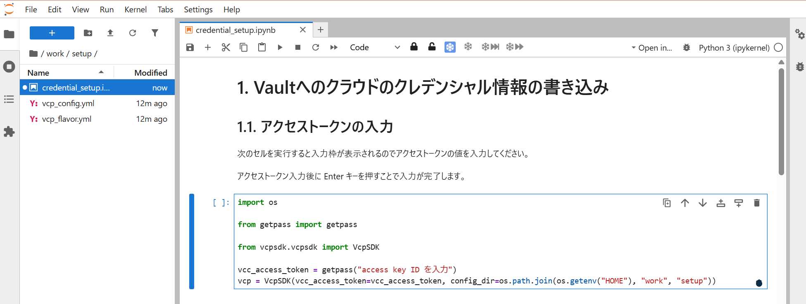

# Jupyter

## 概要

VCPの利用者は、`vcpsdk`（VCコントローラ用のPythonクライアントライブラリ）を用いてVCコントローラへリクエストを送ることで、マシンの起動・停止等の操作を行う。  
本リポジトリでは、その実行環境として `Jupyter Notebook`（JupyterLab）を提供しており、`vcpsdk` を含む VCP SDK 利用可能な環境があらかじめ構築されている。

コンテナには、VCコントローラ・Vaultとの通信用のCA証明書（`cert/occtr_ca.crt`）が組み込まれており、HTTPS通信の検証に利用される。

## アクセス

`http://{VCコントローラのアドレス}:8080/jupyter/` をWebブラウザで開くとログイン画面が表示される。

初回アクセス時はログイン用トークンの入力が必要になる。以下のコマンドでコンテナのログから初期トークンを確認する。

```
# docker compose logs jupyter | grep token
```

URLのクエリパラメータ部分の `token` の値がJupyter Notebookサーバログイン用のトークンとなる。

```
# docker compose logs jupyter | grep token
jupyter-1  | [I 2026-09-17 12:35:35.324 ServerApp] http://localhost:8888/jupyter/lab?token=xxxxxxxxxx
```

初回ログイン時に、同時にパスワードを設定すると、以降はパスワードによるログインも可能となる。


## VCコントローラの利用セットアップ

ログイン後のJupyterLab環境には、あらかじめ `work/setup/` 以下に以下のファイルが用意されている。

|ファイル|用途|
|---|---|
|`credential_setup.ipynb`|クラウドプロバイダの認証情報をVaultへ登録するためのノートブック|
|`vcp_config.yml`|`vcpsdk` がVCコントローラへ接続するための設定ファイル（接続先ホスト名等）|
|`vcp_flavor.yml`|`vcpsdk` でVCノードを起動する際に指定するマシンスペック（flavor）のプリセット定義|

`work/setup/credential_setup.ipynb` を開き、ノートブック上の説明に従って操作する。



1. VCコントローラ用のアクセストークンを入力し、`VcpSDK` クライアントを初期化する。  
    アクセストークンは、[VCP REST APIアクセストークンの発行](../manipulation.md#vcp-rest-apiアクセストークンの発行)で発行したものを使用する。
2. 利用するクラウドプロバイダの認証情報を入力し、Vaultへ登録する。

セットアップ完了後は、`vcpsdk` を用いて任意のノートブック上からVCコントローラの機能（マシンの起動・停止等）を利用できる。

> [!NOTE]
> `vcp_config.yml`, `vcp_flavor.yml` の設定値は、クラウドプロバイダの追加やマシンスペックの変更に応じて編集する。
